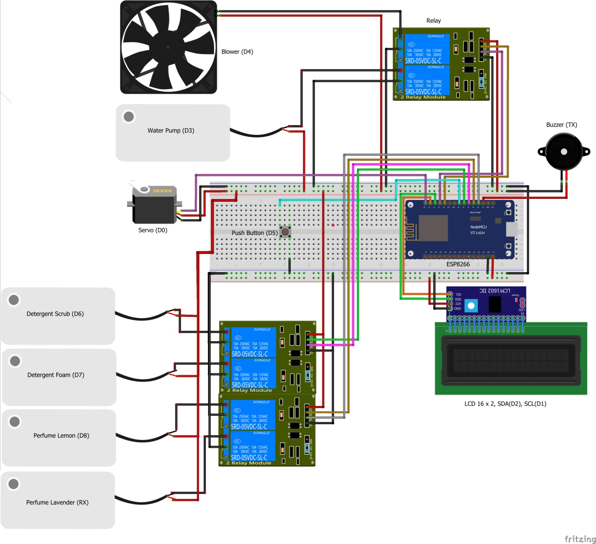

# Helmet Washing Machine IoT System

## Deskripsi
Sistem Pencuci Helm Otomatis berbasis IoT menggunakan ESP8266 adalah sebuah solusi modern untuk membersihkan helm secara otomatis. Sistem ini menggunakan pompa DC 5V untuk sistem penyemprotan cairan (air, sabun, dan parfum) serta fan DC untuk sistem pengeringan, yang semuanya dapat dikontrol melalui web server.

## Fitur
- Kontrol melalui web server
- Dua pilihan mode pencucian:
  - Pencucian lengkap (dengan sabun dan parfum)
  - Dry cleaning (pengeringan saja)
- Dua jenis sabun yang tersedia:
  - Scrub (menggunakan pompa DC 5V)
  - Foam (menggunakan pompa DC 5V)
- Dua pilihan parfum:
  - Lavender (menggunakan pompa DC 5V)
  - Lemon (menggunakan pompa DC 5V)
- Sistem penyemprotan air dengan pompa DC 5V
- Sistem pengeringan menggunakan fan DC
- Display LCD untuk status operasi
- Sistem keamanan dengan validasi IP
- Notifikasi dengan buzzer
- Sensor pintu untuk memastikan keamanan operasi
- Sistem tracking menggunakan machine ID
- Integrasi dengan backend server untuk monitoring status

## Komponen Hardware
- ESP8266 NodeMCU
- LCD I2C (16x2)
- Servo Motor
- Pompa DC 5V (5 unit):
  - 1 unit untuk penyemprotan air
  - 2 unit untuk sabun (scrub dan foam)
  - 2 unit untuk parfum (lavender dan lemon)
- Fan DC untuk sistem pengeringan
- Push Button untuk sensor pintu
- Buzzer
- Power Supply 5V
- Relay Module (untuk kontrol pompa dan fan)
- Selang air
- Wadah penampung (untuk air, sabun, dan parfum)

## Pin Configuration
```
- D0: Servo Motor
- D3: Water Pump DC 5V
- D4: Fan DC (Blower)
- D5: Door Button
- D6: Sabun Scrub Pump DC 5V
- D7: Sabun Foam Pump DC 5V
- D8: Parfum Lavender Pump DC 5V
- 3 : Parfum Lemon Pump DC 5V
- 1 : Buzzer
```

## Wiring Diagram
### Pompa DC 5V dan Fan DC

1. Setiap pompa DC 5V terhubung ke:
   - VCC pompa → COM relay
   - GND pompa → GND power supply
   - IN relay → Pin digital ESP8266 (sesuai konfigurasi)
   - VCC relay → 5V ESP8266
   - GND relay → GND ESP8266

2. Fan DC terhubung ke:
   - VCC fan → COM relay
   - GND fan → GND power supply
   - IN relay → D4 ESP8266
   - VCC relay → 5V ESP8266
   - GND relay → GND ESP8266

## Dependensi Library
```cpp
#include <ESP8266WiFi.h>
#include <ESP8266WebServer.h>
#include <ArduinoJson.h>
#include <LiquidCrystal_I2C.h>
#include <Servo.h>
#include <ESP8266HTTPClient.h>
```

## Instalasi
1. Clone repository ini
2. Buka project menggunakan Arduino IDE
3. Install semua library yang diperlukan
4. Konfigurasi kredensial WiFi:
   ```cpp
   const char* ssid = "your ssid";
   const char* password = "your pass";
   ```
5. Konfigurasi IP yang diizinkan:
   ```cpp
   const char* allowedIp = "your ip";
   ```
6. Konfigurasi endpoint backend:
   ```cpp
   String url = "http://your_ip:port/api/transaction-finish/" + machineId;
   ```
7. Rakit hardware sesuai wiring diagram
8. Upload kode ke ESP8266

## Penggunaan API
Endpoint: `POST /`

Request Body:
```json
{
    "sabun": "scrub|foam",
    "parfum": "lavender|lemon",
    "machine_id": "string"
}
```

Response Success:
```json
{
    "status": "success",
    "message": "Machine Working"
}
```

Response Error:
```json
{
    "status": "error",
    "message": "Error message"
}
```

## Alur Kerja
1. Sistem menerima request dari web server
2. Validasi IP pengirim
3. Memproses data JSON yang diterima
4. Menampilkan instruksi pada LCD
5. Menunggu pintu ditutup
6. Memulai proses sesuai mode yang dipilih:
   - Mode pencucian lengkap:
     - Semprotan air dengan pompa DC dan gerakan servo
     - Aplikasi sabun dengan pompa DC yang sesuai
     - Pembilasan dengan pompa DC air
     - Pengeringan dengan fan DC
     - Aplikasi parfum dengan pompa DC yang sesuai
   - Mode dry cleaning:
     - Pengeringan menggunakan fan DC saja
7. Mengirim notifikasi ke backend setelah proses selesai

## Perawatan
1. Periksa kondisi selang air secara berkala untuk mencegah kebocoran
2. Bersihkan filter pompa DC secara berkala
3. Pastikan wadah penampung selalu terisi dengan level yang cukup
4. Periksa dan bersihkan fan DC dari debu secara berkala
5. Periksa kondisi relay untuk memastikan switching berfungsi dengan baik

## Troubleshooting
1. Pompa tidak menyemprot:
   - Periksa tegangan power supply
   - Periksa kondisi relay
   - Periksa selang dari sumbatan
   - Pastikan ada cairan dalam wadah penampung

2. Fan tidak berputar:
   - Periksa tegangan power supply
   - Periksa kondisi relay
   - Periksa fan dari kotoran yang menghambat

3. Sistem tidak terkoneksi:
   - Periksa kredensial WiFi
   - Periksa IP yang diizinkan
   - Restart ESP8266

